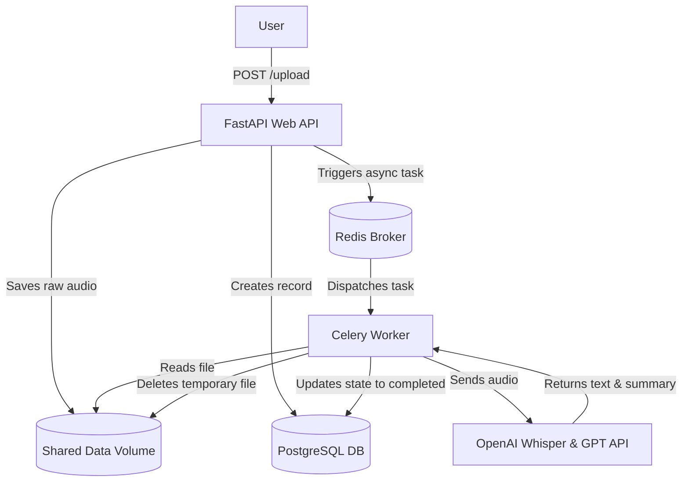

# Asynchronous AI Meeting Assistant

A containerized microservice application built with Python to handle asynchronous audio file processing, automated speech-to-text transcription, and AI-powered meeting summaries.

## 🛠️ Tech Stack
* **FastAPI** — High-performance asynchronous Web API for uploading audio records.
* **PostgreSQL** — Relational database storing meeting metadata, transcripts, and summaries.
* **SQLAlchemy 2.0 (Async)** — Non-blocking ORM integration for seamless state updates.
* **Redis** — Fast message broker facilitating tasks between the API and the worker cluster.
* **Celery** — Distributed background task worker to offload heavy processing from the web thread.
* **Flower** — Real-time web-based monitoring and administration tool for Celery.
* **OpenAI API** — Embedded Whisper-1 for speech transcription and GPT models for core analysis.
* **Docker & Docker Compose** — Orchestration with dedicated isolated networks and Shared Data Volumes.

## 📐 Architecture & Shared Volumes Overview



## 📂 Project Structure

```text
ai_assistant/
├── app/
│   ├── config.py         # Configuration setup via Pydantic Settings
│   ├── crud.py           # Database state management operations
│   ├── database.py       # Engine initialization & SQLAlchemy declarative models
│   ├── main.py           # API route declarations & lifespan configuration
│   ├── schemas.py        # Data verification layers (DTOs)
│   └── worker.py         # Celery app context & background async logic
├── shared_data/          # Mounted folder for cross-container file streaming
├── .env.example          # Environment variable mapping blueprint
├── .gitignore            # Git exclusion mapping rules
├── Dockerfile            # Lightweight Python service image setup
└── docker-compose.yml    # Comprehensive orchestration configuration
```

## 🚀 Getting Started

### Prerequisites
Ensure **Docker Desktop** is running on your machine.

### Installation & Launch

1. Navigate to the project folder:
   ```bash
   cd ai_assistant
   ```

2. Generate your `.env` configuration file:
   ```bash
   cp .env.example .env
   ```
   *(Optional: Populate `OPENAI_API_KEY` with your token. If left default, the service uses internal simulation fallbacks without failing).*

3. Run the multi-container configuration:
   ```bash
   docker compose up --build
   ```

Once deployed, the systems will be available at:
* 🌐 **Interactive Web Documentation (Swagger UI)**: http://localhost:8000/docs
* 📊 **Celery Flower Monitoring Dashboard**: http://localhost:5555

## 🧪 API Specifications

* **`POST /upload`** — Validates incoming media attachments (.mp3, .wav, .m4a), pipes them directly into the secure shared sector, and triggers immediate out-of-thread transcription processing.
* **`GET /meetings/{meeting_id}`** — Performs structural polls against the persistent schema returning instant lifecycle tracking (`processing` ➔ `completed`) and rendering the generated metadata.
